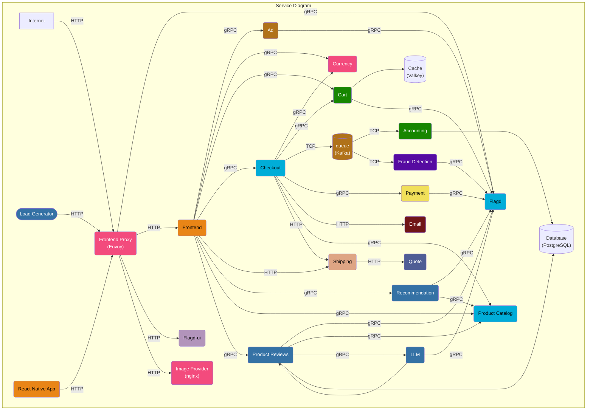
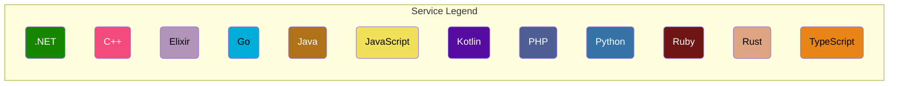

# 🚀 Ultimate DevOps Implementation: Microservices on AWS EKS


A complete end-to-end DevOps lifecycle implementation for a distributed microservices architecture (based on the OpenTelemetry Demo). This project demonstrates Infrastructure as Code (IaC), containerization strategies, and local-to-cloud deployment on AWS.

## 🏗️ Architecture

### OpenTelemetry Original Architecture Diagram





## 🎯 Project Objectives & Achievements

**Infrastructure Automation**
Provisioned a production-grade AWS environment using Terraform, including a custom VPC (public/private subnets), NAT Gateway, Internet Gateway, and an EKS cluster with managed node groups.

**Containerization & Optimization**
Designed multi-stage Dockerfiles for Go-based microservices (*product-catalog*, *ad*, *recommendation*), significantly reducing image size and improving build efficiency.

**Local Validation Pipeline**
Implemented Docker Compose to simulate a microservices environment locally, ensuring seamless inter-service communication before deploying to the cloud.

---

## 🛠️ Tech Stack

* **Cloud Provider:** AWS (EC2, EKS, VPC, IAM)
* **Containerization:** Docker, Docker Compose, DockerHub
* **Infrastructure as Code:** Terraform
* **Microservices:** OpenTelemetry Demo Applications (Go, Python, Java)

---

## 📋 Prerequisites

Ensure the following tools are installed and configured:

* **AWS CLI** – Configured with IAM credentials (`aws configure`)
* **Terraform (v1.0+)** – For infrastructure provisioning
* **kubectl** – For Kubernetes cluster interaction
* **Docker & Docker Compose** – For local builds and testing

---

## 🚀 Implementation Workflow

### Phase 1: Local Setup & Infrastructure Provisioning

* Provisioned a **t2.large EC2 instance** as a bastion host with custom security groups
* Dynamically expanded EBS volume to handle container workloads:

  ```bash
  sudo growpart /dev/xvda 1
  sudo resize2fs /dev/xvda1
  ```
* Installed Docker, kubectl, and Terraform
* Validated microservices locally using:

  ```bash
  docker-compose up -d
  ```
* Provisioned AWS infrastructure (VPC, EKS, node groups) using modular Terraform code

---

### Phase 2: Kubernetes Deployment

* Built and pushed optimized Docker images to a remote registry
* Deployed microservices onto AWS EKS
* Implemented namespace-based isolation (e.g., `app-production`, `monitoring`)
* Configured Kubernetes services:

  * **ClusterIP** for internal communication
  * **LoadBalancer** for external access

---

## 💻 How to Run the Project

### 1. Clone & Run Locally

```bash
git clone https://github.com/akashp490/OpenTelemetry-DevOps-Implementation.git
cd OpenTelemetry-DevOps-Implementation
docker-compose up -d
```

### 2. Provision Infrastructure

```bash
cd terraform
terraform init
terraform plan
terraform apply --auto-approve
```

### 3. Deploy to EKS

```bash
aws eks update-kubeconfig --region <your-region> --name <your-cluster-name>
cd ../kubernetes
kubectl apply -f .
```

---

## 🛑 Cleanup & Cost Management

To avoid unnecessary AWS charges (~$3–$5/day for EKS, NAT Gateway, and Load Balancers), destroy infrastructure after use:

```bash
cd terraform
terraform destroy --auto-approve
```

---

## 🧠 Challenges & Key Learnings

* **Volume Mount Issues**
  Resolved data-sharing failures by correctly configuring Kubernetes `EmptyDir` volumes between pods

* **Service Exposure**
  Transitioned from internal-only (`ClusterIP`) services to externally accessible endpoints using AWS LoadBalancer and NodePort

* **Docker Optimization**
  Reduced image sizes by ~60% using multi-stage builds with lightweight runtime images (Alpine/Distroless)

* **Terraform State Management**
  Addressed state locking issues and improved reliability by migrating state from local storage to a remote backend
